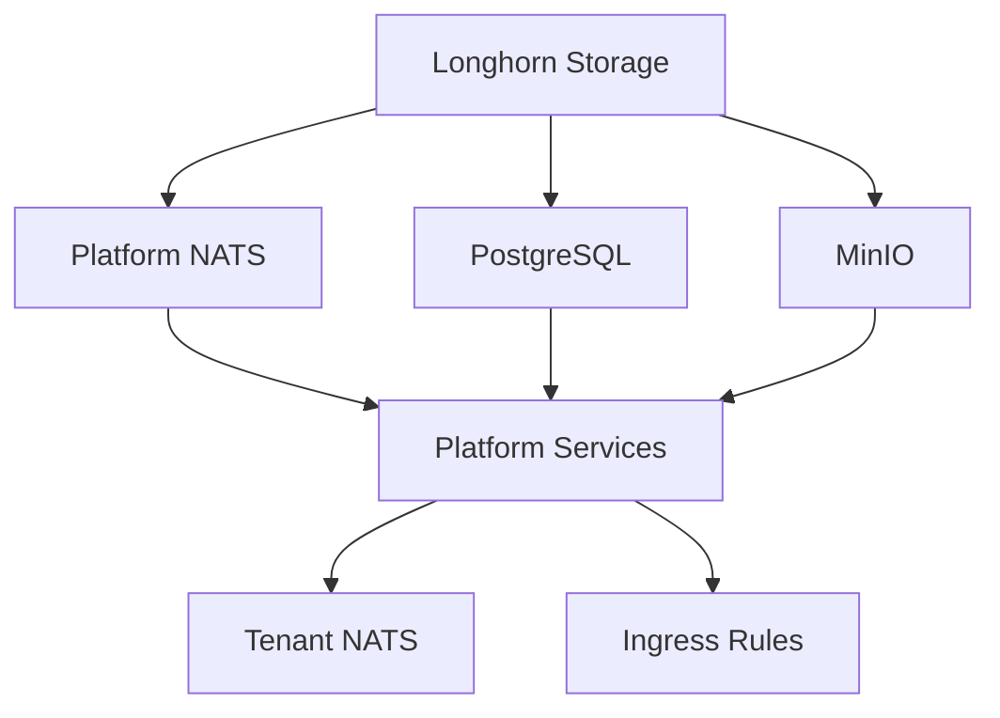

# VRSky Kubernetes Manifests

This directory contains all Kubernetes manifests for deploying the VRSky integration platform.

## Directory Structure

```
kubernetes/
├── platform-nats/       # Platform NATS cluster (HA, JetStream, KV)
├── tenant-nats/         # Tenant NATS templates (ephemeral, per-tenant)
├── postgresql/          # PostgreSQL database
├── minio/               # MinIO object storage (S3-compatible)
├── monitoring/          # Prometheus + Grafana
├── ingress/             # Nginx Ingress + cert-manager + Let's Encrypt
└── deploy-vrsky-platform.sh  # Main deployment automation script
```

## Quick Start

### Prerequisites

1. **Kubernetes cluster** with kubectl configured
2. **Helm 3** installed
3. **Longhorn storage** installed (or another StorageClass named `longhorn`)

Verify:

```bash
kubectl cluster-info
helm version
kubectl get storageclass longhorn
```

### Automated Deployment

```bash
# Deploy entire VRSky platform infrastructure
cd infrastructure/kubernetes
./deploy-vrsky-platform.sh
```

This script will:

1. ✅ Check prerequisites (kubectl, helm, cluster connection)
2. ✅ Deploy Platform NATS (3-node HA cluster)
3. ✅ Deploy PostgreSQL (with schema initialization)
4. ✅ Deploy MinIO (S3-compatible storage)
5. ⚠️ Optionally deploy Monitoring (Prometheus + Grafana)
6. ⚠️ Optionally deploy Ingress & TLS (cert-manager)
7. ⚠️ Optionally provision demo tenant NATS

**Total deployment time**: ~10-15 minutes (depending on image pulls)

### Manual Deployment

If you prefer step-by-step manual deployment, see individual component READMEs:

1. [Platform NATS](platform-nats/README.md) - Core messaging infrastructure
2. [PostgreSQL](postgresql/README.md) - Platform database
3. [MinIO](minio/README.md) - Object storage for large payloads
4. [Tenant NATS](tenant-nats/README.md) - Per-tenant message transport
5. [Monitoring](monitoring/README.md) - Prometheus + Grafana
6. [Ingress](ingress/README.md) - TLS certificates and routing

## Deployment Order

**Critical Dependencies**:



**Required order**:

1. Longhorn (storage) - **must exist first**
2. Platform NATS, PostgreSQL, MinIO - **can deploy in parallel**
3. Monitoring, cert-manager - **optional, can deploy anytime**
4. Tenant NATS - **after PostgreSQL** (needs database for tracking)
5. Ingress rules - **after API Gateway** (service must exist)

## Verification

### Check All Resources

```bash
# Get all VRSky namespaces
kubectl get namespaces | grep vrsky

# Get all pods
kubectl get pods -A | grep vrsky

# Get all services
kubectl get svc -A | grep vrsky

# Get all PVCs
kubectl get pvc -A | grep vrsky
```

### Check Component Health

```bash
# Platform NATS
kubectl get pods -n vrsky-platform -l app=nats-platform
kubectl logs -n vrsky-platform nats-platform-0

# PostgreSQL
kubectl get pods -n vrsky-database -l app=postgresql
kubectl exec -n vrsky-database postgresql-0 -- psql -U vrsky -d vrsky -c "SELECT COUNT(*) FROM tenants;"

# MinIO
kubectl get pods -n vrsky-storage -l app=minio
kubectl logs -n vrsky-storage -l app=minio

# Monitoring (if installed)
kubectl get pods -n vrsky-monitoring

# Tenant NATS (if provisioned)
kubectl get pods -n vrsky-tenants
```

### Test Services

```bash
# Platform NATS connection
kubectl run -it --rm nats-box --image=natsio/nats-box --restart=Never -n vrsky-platform -- \
  nats server info nats://nats-platform.vrsky-platform.svc.cluster.local:4222

# PostgreSQL connection
kubectl port-forward -n vrsky-database svc/postgresql 5432:5432 &
psql -h localhost -U vrsky -d vrsky -c "SELECT * FROM tenants;"

# MinIO console
kubectl port-forward -n vrsky-storage svc/minio 9001:9001 &
open http://localhost:9001

# Grafana
kubectl port-forward -n vrsky-monitoring svc/grafana 3000:80 &
open http://localhost:3000
```

## Configuration

### Update Credentials

⚠️ **IMPORTANT**: Change default passwords before production deployment!

1. **PostgreSQL**:

   ```bash
   # Edit infrastructure/kubernetes/postgresql/secret.yaml
   # Generate new password:
   openssl rand -base64 32
   ```

2. **MinIO**:

   ```bash
   # Edit infrastructure/kubernetes/minio/secret.yaml
   # Generate new credentials:
   openssl rand -hex 16  # Access key
   openssl rand -base64 32  # Secret key
   ```

3. **Grafana**:
   ```bash
   # Edit infrastructure/kubernetes/monitoring/grafana-values.yaml
   # Change adminPassword
   ```

### Update Domains

For Ingress (external access):

1. Edit `infrastructure/kubernetes/ingress/ingress.yaml`
2. Replace `api.vrsky.example.com` with your domain
3. Replace `grafana.vrsky.example.com` with your domain
4. Edit `infrastructure/kubernetes/ingress/cert-issuers.yaml`
5. Update email for Let's Encrypt notifications

## Scaling

### Platform NATS

Scale to 5 nodes:

```bash
kubectl scale statefulset nats-platform -n vrsky-platform --replicas=5
# Update configmap.yaml to add new routes
kubectl apply -f platform-nats/configmap.yaml
kubectl rollout restart statefulset/nats-platform -n vrsky-platform
```

### PostgreSQL

For production HA, consider:

- PostgreSQL replication (primary + replica)
- Patroni for automatic failover
- Crunchy Data PostgreSQL Operator

### MinIO

For production HA, use distributed mode:

```bash
# Use MinIO Operator
kubectl apply -k github.com/minio/operator
kubectl minio tenant create vrsky-minio \
  --servers 4 \
  --volumes 16 \
  --capacity 400Gi \
  --storage-class longhorn
```

### Tenant NATS

Auto-scaling is managed by the Control Plane (application code).
Manual provisioning:

```bash
cd tenant-nats
./provision-tenant-nats.sh <tenant-id> <instance-number>
```

## Monitoring

### Access Dashboards

```bash
# Grafana
kubectl port-forward -n vrsky-monitoring svc/grafana 3000:80
# Open: http://localhost:3000
# Login: admin / changeme-grafana-password

# Prometheus
kubectl port-forward -n vrsky-monitoring svc/prometheus-kube-prometheus-prometheus 9090:9090
# Open: http://localhost:9090
```

### Key Metrics

- **Platform NATS**: JetStream streams, KV buckets, message rate
- **Tenant NATS**: Message rate per tenant, connections, memory
- **PostgreSQL**: Connections, query duration, database size
- **MinIO**: Storage usage, API requests, bandwidth
- **Kubernetes**: Pod restarts, CPU/memory usage, node health

## Troubleshooting

### Pods Not Starting

```bash
# Check pod status
kubectl describe pod <pod-name> -n <namespace>

# Common issues:
# - PVC not bound: Check Longhorn is running
# - Image pull errors: Check internet connectivity
# - Resource limits: Check node capacity
```

### Storage Issues

```bash
# Check Longhorn
kubectl get pods -n longhorn-system

# Check PVCs
kubectl get pvc -A

# Check PV provisioning
kubectl get pv
```

### Network Issues

```bash
# Check DNS resolution
kubectl run -it --rm debug --image=busybox --restart=Never -- \
  nslookup nats-platform.vrsky-platform.svc.cluster.local

# Check service endpoints
kubectl get endpoints -A | grep vrsky

# Check network policies
kubectl get networkpolicies -A
```

### Database Connection Issues

```bash
# Check PostgreSQL logs
kubectl logs -n vrsky-database postgresql-0

# Test connection from another pod
kubectl run -it --rm psql-test --image=postgres:18-alpine --restart=Never -n vrsky-database -- \
  psql -h postgresql.vrsky-database.svc.cluster.local -U vrsky -d vrsky

# Check secret
kubectl get secret postgres-credentials -n vrsky-database -o yaml
```

## Backup & Recovery

### Backup All Data

```bash
# Platform NATS (JetStream data)
kubectl exec -n vrsky-platform nats-platform-0 -- tar czf /tmp/jetstream-backup.tar.gz /data/jetstream
kubectl cp vrsky-platform/nats-platform-0:/tmp/jetstream-backup.tar.gz ./jetstream-backup.tar.gz

# PostgreSQL
kubectl exec -n vrsky-database postgresql-0 -- \
  pg_dump -U vrsky -d vrsky -F c -f /tmp/vrsky-backup.dump
kubectl cp vrsky-database/postgresql-0:/tmp/vrsky-backup.dump ./vrsky-backup.dump

# MinIO (use mc client or Longhorn snapshot)
kubectl annotate pvc minio-data -n vrsky-storage \
  snapshot.storage.kubernetes.io/snapshot-name=minio-backup-$(date +%Y%m%d)
```

### Restore from Backup

```bash
# PostgreSQL
kubectl cp ./vrsky-backup.dump vrsky-database/postgresql-0:/tmp/
kubectl exec -n vrsky-database postgresql-0 -- \
  pg_restore -U vrsky -d vrsky -c /tmp/vrsky-backup.dump

# Platform NATS
kubectl cp ./jetstream-backup.tar.gz vrsky-platform/nats-platform-0:/tmp/
kubectl exec -n vrsky-platform nats-platform-0 -- \
  tar xzf /tmp/jetstream-backup.tar.gz -C /
```

## Cleanup

### Uninstall Individual Components

```bash
# Platform NATS
kubectl delete -f platform-nats/

# PostgreSQL
kubectl delete -f postgresql/

# MinIO
kubectl delete -f minio/

# Monitoring
helm uninstall prometheus -n vrsky-monitoring
helm uninstall grafana -n vrsky-monitoring

# Ingress
helm uninstall cert-manager -n cert-manager
kubectl delete -f ingress/ingress.yaml

# Tenant NATS
cd tenant-nats
./delete-tenant-nats.sh <tenant-id> <instance-number>
```

### Uninstall Entire Platform

```bash
# Delete all VRSky namespaces (will delete all resources)
kubectl delete namespace vrsky-platform
kubectl delete namespace vrsky-database
kubectl delete namespace vrsky-storage
kubectl delete namespace vrsky-tenants
kubectl delete namespace vrsky-monitoring
kubectl delete namespace cert-manager

# Delete PVCs (if not auto-deleted)
kubectl delete pvc -A --selector=app=nats-platform
kubectl delete pvc -A --selector=app=postgresql
kubectl delete pvc -A --selector=app=minio

# Delete cluster-wide resources
kubectl delete clusterissuer letsencrypt-staging letsencrypt-prod
```

## Environment Variables

The deployment script supports these environment variables:

```bash
# Skip monitoring installation
SKIP_MONITORING=true ./deploy-vrsky-platform.sh

# Skip Ingress installation
SKIP_INGRESS=true ./deploy-vrsky-platform.sh

# Skip both
SKIP_MONITORING=true SKIP_INGRESS=true ./deploy-vrsky-platform.sh
```

## Production Checklist

Before deploying to production:

- [ ] Update PostgreSQL password in `postgresql/secret.yaml`
- [ ] Update MinIO credentials in `minio/secret.yaml`
- [ ] Update Grafana password in `monitoring/grafana-values.yaml`
- [ ] Update domain names in `ingress/ingress.yaml`
- [ ] Update email in `ingress/cert-issuers.yaml`
- [ ] Switch cert-manager to `letsencrypt-prod`
- [ ] Configure backup schedules (CronJobs)
- [ ] Set up monitoring alerts
- [ ] Configure Ingress rate limiting
- [ ] Review resource limits
- [ ] Enable NetworkPolicies
- [ ] Set up log aggregation
- [ ] Configure disaster recovery plan

## References

- [Platform NATS README](platform-nats/README.md)
- [PostgreSQL README](postgresql/README.md)
- [MinIO README](minio/README.md)
- [Tenant NATS README](tenant-nats/README.md)
- [Monitoring README](monitoring/README.md)
- [Ingress README](ingress/README.md)
- [VRSky NATS Architecture](../../docs/NATS_ARCHITECTURE.md)
- [VRSky POC Scope](../../docs/POC_SCOPE.md)
